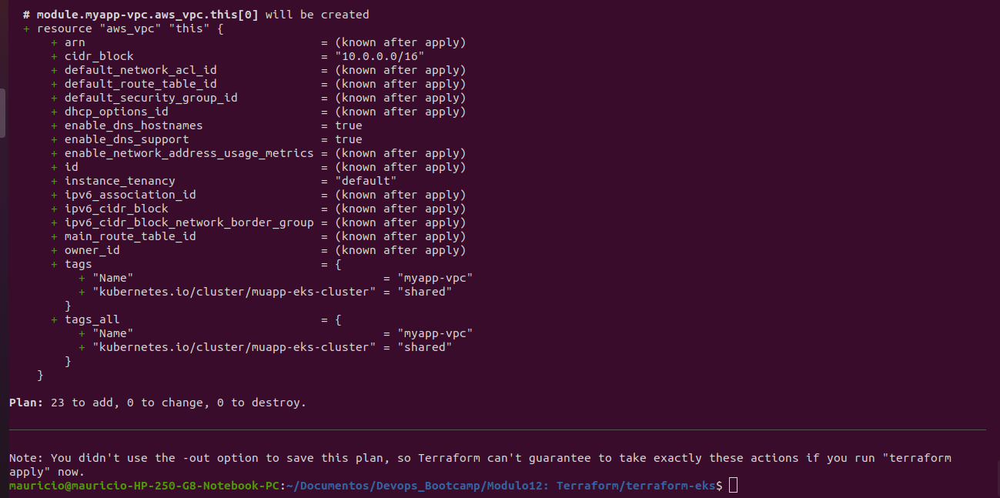
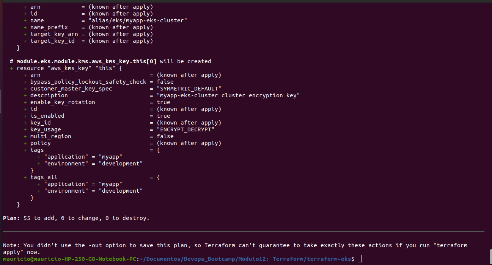

# Demo Project 1

Automate AWS Infrastructure

## Technologies Used

Terraform, AWS, Docker, Linux, Git

## Project Description

- Create TF project to automate provisioning AWS Infrastructure and its components, such as: VPC, Subnet, Route Table, Internet Gateway, EC2, Security Group
- Configure TF script to automate deploying Docker container to EC2 instance

### Details of project

- Creating VPC and Subnets

  Initially, the VPC and subnets were created using the template file provided in the project description. The only parameters used were:
  - `cidr_block`, set as a variable
  - A tag indicating the environment where these resources are being deployed

  To connect Terraform to the AWS account, the `AWS_ACCESS_KEY_ID` and `AWS_SECRET_ACCESS_KEY` variables, created in the AWS module, were exported in the terminal. Then, running:

  ```sh
  terraform init
  ```

  This command downloaded the provider files locally. After that, the resources were created by running the command:

  ```sh
  terraform apply
  ```

  It displays the components Terraform will create by default.

  After applying Terraform, the AWS console shows the following resources created automatically:
  - **Route Table:** Acts as a virtual router for the VPC
  - **Network ACL:** Functions as a firewall for the subnets

  At this stage, communication is only enabled within the VPC. To allow internet access, the route table needs a connection to an **Internet Gateway**.

- Creating an Internet Gateway and Route Table

  A new route table was created with rules for internet connectivity. The internal connection rule to the VPC is automatically created, so only the internet gateway entry was defined.

  The route was set with:
    - `cidr_block = 0.0.0.0/0` to allow access from all IPs
    - The ID of the internet gateway, which is also created via Terraform

  The internet gateway requires only the VPC ID to be created.

- Associating Subnets with Route Table

  Once these resources are created, subnets need to be associated with the route table that has the internet gateway. This is done using `aws_route_table_association`:

  ```hcl
  resource "aws_route_table_association" "a-rtb-subnet" {
    subnet_id      = aws_subnet.myapp-subnet-1.id
    route_table_id = aws_route_table.myapp-route-table.id
  }
  ```

  Alternatively, the default route table can be used for connections:

  ```hcl
  resource "aws_default_route_table" "main-rtb" {
    default_route_table_id = aws_vpc.myapp-vpc.default_route_table_id

    route {
      cidr_block = "0.0.0.0/0"
      gateway_id = aws_internet_gateway.myappp-igw.id
    }

    tags = {
      Name = "${var.env_prefix}-main-rtb"
    }
  }
  ```

- Security Group

  Security groups were configured to allow traffic on ports 22 (SSH) and 8080 (Nginx). Two approaches were considered:
  1. Creating a new security group
  2. Using the default VPC security group

  Both options require association with the VPC ID. The following ingress and egress rules were defined:

  ```hcl
  resource "aws_default_security_group" "default-sg" {
    vpc_id = aws_vpc.myapp-vpc.id

    ingress {
      from_port   = 22
      to_port     = 22
      protocol    = "TCP"
      cidr_blocks = [var.my_ip] # My own IP address
    }

    ingress {
      from_port   = 8080
      to_port     = 8080
      protocol    = "TCP"
      cidr_blocks = ["0.0.0.0/0"] # Open access to the app
    }

    egress {
      from_port   = 0
      to_port     = 0
      protocol    = "-1" # Any protocol is accepted
      cidr_blocks = ["0.0.0.0/0"]
    }

    tags = {
      Name = "${var.env_prefix}-default-sg"
    }
  }
  ```

- EC2 Image and Instance

  To dynamically select the latest Amazon Linux image, the following data resource was used:

  ```hcl
  data "aws_ami" "latest-amazon-linux-image" {
    most_recent = true
    owners      = ["amazon"]

    filter {
      name   = "name"
      values = ["amzn2-ami-kernel-*-x86_64-gp2"]
    }

    filter {
      name   = "virtualization-type"
      values = ["hvm"]
    }
  }

  output "aws_ami_id" {
    value = data.aws_ami.latest-amazon-linux-image.id
  }
  ```

- Creating an EC2 Instance

  ```hcl
  resource "aws_instance" "myapp-server" {
    ami               = data.aws_ami.latest-amazon-linux-image.id
    instance_type     = var.instance_type # e.g., t2.micro
    subnet_id         = aws_subnet.myapp-subnet-1.id
    vpc_security_group_ids = [aws_default_security_group.default-sg.id]
    availability_zone = var.avail_zone

    associate_public_ip_address = true
    key_name = "server-key-pair"

    tags = {
      Name = "${var.env_prefix}-server"
    }
  }
  ```

  A new SSH key was created and moved to the `.ssh` folder with proper permissions.

- Automating Key Pair Creation

  Instead of manually generating and downloading a new key from AWS, an existing key can be used within Terraform:

  ```hcl
  resource "aws_key_pair" "ssh-key" {
    key_name   = "server-key"
    public_key = file(var.public_key_location)
  }
  ```

  And in the EC2 instance:

  ```hcl
  key_name = aws_key_pair.ssh-key.key_name
  ```

  This process will destroy the previously created instance and launch a new one with the updated key, enabling SSH access without manually referencing the key.

  With this, all the resources are now configured and they will be considered in the terraform apply commnad, with a total of 7 resources:

  

- Running an Entrypoint Script to Start a Docker Container

  Now that the instance is running, it needs to be configured to install Docker and run an application. This is achieved using the `user_data` attribute in EC2, which acts as an entrypoint script:

  ```hcl
  user_data = <<EOF
                  #!/bin/bash
                  sudo yum update -y && sudo yum install -y docker
                  sudo systemctl start docker
                  sudo usermod -aG docker ec2-user
                  docker run -p 8080:80 nginx
              EOF

  user_data_replace_on_change = true
  ```

  Each time the script is modified, Terraform will destroy and recreate the instance, ensuring the updated script runs on launch.

  Once the configuration is complete, the Nginx server can be accessed via the public IP on port 8080.

- Extracting Shell Script

  For larger scripts, an external file can be referenced using `file()`, similar to the SSH key setup.

  To check all resources created by Terraform in this project, run:

  ```sh
  terraform state list
  ```
  


# Demo Project 2

Modularize Project

## Technologies Used

Terraform, AWS, Docker, Linux, Git

## Project Description

- Divide Terraform resources into reusable modules

### Details of project

- Clean up `main.tf`

  A good practice when creating Terraform projects is to separate files into `main.tf`, `variables.tf`, `output.tf`, and `providers.tf`. The `main.tf` file should contain only the resource definitions, so outputs and variable declarations were removed from this file.

- Create a Module

  Two directories were created to serve as modules in this project: one named `subnet` and the other `webserver`. Each module contains its own standard files.

  Creating modules makes sense when grouping multiple resources into logical units. It is not very useful to create modules for just one or two resources.

  Inside the `subnet` module, three resources were added: `aws_subnet`, `aws_internet_gateway`, and `aws_default_route_table`. All parameters were defined using variables, which are passed from the main configuration. These variables need to be imported into the module directory for them to work properly.

- Use the Module

  To reference the module in the root `main.tf` file, use the following structure:

  ```hcl
  module "myapp-subnet" {
    source                  = "./modules/subnet" # Location of the module
    subnet_cidr_block       = var.subnet_cidr_block
    avail_zone              = var.avail_zone
    env_prefix              = var.env_prefix
    vpc_id                  = aws_vpc.myapp-vpc.id
    default_route_table_id  = aws_vpc.myapp-vpc.default_route_table_id
  }
  ```

  Here, `source` specifies the module’s location, and variables are passed to child modules as arguments. These variables are configured in the `terraform.tfvars` file.

- Module Output

  Since the subnet resources are now inside a module, there needs to be a way to reference their values. For example, when creating an instance, the `subnet_id` is required. This is resolved by defining an output in the module:

  ```hcl
  output "subnet" {
    value = aws_subnet.myapp-subnet-1
  }
  ```

  In the `aws_instance` resource:

  ```hcl
  subnet_id = module.myapp-subnet.subnet.id
  ```

  For modules to work, run `terraform init` to initialize and recognize them.

  


- Create Webserver Module

  Inside the `webserver` module, the following resources were added: `aws_instance`, `aws_key_pair`, `aws_ami`, and `aws_default_security_group`. These resources were reconfigured to use the appropriate variables, and the module was referenced in `main.tf`:

  ```hcl
  module "myapp-server" {
    source              = "./modules/webserver" # Location of the module
    vpc_id              = aws_vpc.myapp-vpc.id
    my_ip               = var.my_ip
    env_prefix          = var.env_prefix
    image_name          = var.image_name
    public_key_location = var.public_key_location
    instance_type       = var.instance_type
    subnet_id           = module.myapp-subnet.subnet.id
    avail_zone          = var.avail_zone
  }
  ```

  One issue encountered during `terraform apply` was that the key pair already existed in AWS. It had to be removed manually before running `terraform apply` again. After this adjustment, the resources were successfully created.

  

# Demo Project 3

Terraform & AWS EKS

## Technologies Used

Terraform, AWS EKS, Docker, Linux, Git

## Project Description

- Automate provisioning EKS cluster with Terraform

### Details of project  

### VPC Creation

  An existing module was used for the VPC creation as it simplifies the code and creates various necessary components that make up the network. The module's code is downloaded when the terraform init command is executed.

- Basic VPC Configuration

  ```hcl
    name = "myapp-vpc"
    cidr = var.vpc_cidr_block
    private_subnets = var.private_subnet_cidr_blocks
    public_subnets = var.public_subnet_cidr_blocks
    azs = data.aws_availability_zones.azs.names
  ```

    name: The name of the VPC to facilitate identification.
    cidr: CIDR block for the VPC, passed as a variable (var.vpc_cidr_block). It defines the range of available IPs.
    private_subnets: List of CIDR blocks for private subnets, defined by variables.
    public_subnets: List of CIDR blocks for public subnets.
    azs: Uses data from AWS availability zones to distribute subnets, ensuring high availability.

- NAT and DNS Configuration

  ```hcl
    enable_nat_gateway = true 
    single_nat_gateway = true 
    enable_dns_hostnames = true 
  ```
  enable_nat_gateway: Activates the creation of a NAT Gateway to allow instances in private subnets to access the internet.
  single_nat_gateway: Configures a single NAT Gateway shared by all private subnets.
  enable_dns_hostnames: Allows the creation of DNS hostnames for EC2 instances, making access easier.

- Tags for Kubernetes Integration

  ```hcl
    tags = {
    "kubernetes.io/cluster/muapp-eks-cluster" = "shared"
    } 
  ```
  tags: Defines tags in the VPC to facilitate integration with an EKS cluster (Kubernetes managed by AWS).
  "kubernetes.io/cluster/muapp-eks-cluster" = "shared": Informs EKS that this VPC can be used by multiple resources within the cluster.

- Tags for Public Subnets

  ```hcl
    public_subnet_tags = {
    "kubernetes.io/cluster/muapp-eks-cluster" = "shared"
    "kubernetes.io/role/elb" = 1
    }
  ```
  public_subnet_tags: Defines specific tags for public subnets.
  "kubernetes.io/role/elb": Indicates that these subnets can host public Load Balancers (ELB) in EKS.

- Tags for Private Subnets

 ```hcl
    private_subnet_tags = {
        "kubernetes.io/cluster/muapp-eks-cluster" = "shared"
        "kubernetes.io/role/internal-elb" = 1
    }  
  ```
  private_subnet_tags: Defines tags for private subnets.
  "kubernetes.io/role/internal-elb": Indicates that these subnets can host internal Load Balancers in EKS.

  By applying the terraform plan command, it can be checked all the resources that will be created using this module.

  

### EKS Cluster Creation

  This module configures an Amazon EKS (Elastic Kubernetes Service) cluster using the official terraform-aws-modules/eks/aws module. It simplifies EKS cluster creation and management, handling resources like node groups, networking, and security.

- Basic EKS Configuration

  ```hcl
    module "eks" {
      source = "terraform-aws-modules/eks/aws"
      version = "19.17.2"

      cluster_name = "myapp-eks-cluster"
      cluster_version = "1.27"
      cluster_endpoint_public_access = true  
    }
  ```

  source and version: Specifies the module source and version to ensure compatibility and consistency.
  cluster_name: Defines the name of the EKS cluster, making it easier to identify.
  cluster_version: Specifies the Kubernetes version (1.27) to be used for the cluster.
  cluster_endpoint_public_access: Enables public access to the cluster's API endpoint, allowing external access to manage the cluster.

- Networking Configuration

  ```hcl
    subnet_ids = module.myapp-vpc.private_subnets
    vpc_id = module.myapp-vpc.vpc_id
  ```
  subnet_ids: Specifies the private subnets created by the VPC module where the EKS cluster will deploy its resources.
  vpc_id: Links the EKS cluster to the VPC created by the myapp-vpc module, ensuring all resources are contained within the same VPC.

- Tags for Resource Identification

  ```hcl
    tags = {
        environment = "development"
        application = "myapp"
    }  
  ```
  tags: Applies tags to all EKS resources, using environment and application name.

- Managed Node Groups Configuration

  ```hcl
    eks_managed_node_groups = {
        dev = {
            min_size = 1
            max_size = 3
            desired_size = 3

            instance_types = ["t2.small"]
        }
    }  
  ```
  eks_managed_node_groups: Configures a managed node group named dev for the EKS cluster.
  min_size: Sets the minimum number of nodes to 1.
  max_size: Sets the maximum number of nodes to 3.
  desired_size: Specifies the desired number of nodes as 3, ensuring enough resources for workloads.
  instance_types: Defines the instance type (t2.small) for the worker nodes, balancing cost and performance.

  With this configuration, all the components of the EKS cluster are ready to be provisioned.

  

  It takes between 10-15 minutes to create all the resources.

  


# Demo Project 4

Complete CI/CD with Terraform

## Technologies Used

Terraform, Jenkins, Docker, AWS, Git, Java, Maven, Linux, Docker Hub

## Project Description

Integrate provisioning stage into complete CI/CD Pipeline to automate provisioning server instead of
deploying to an existing server

- Create SSH Key Pair
- Install Terraform inside Jenkins container
- Add Terraform configuration to application’s git repository
- Adjust Jenkinsfile to add “provision” step to the CI/CD pipeline that provisions EC2 instance
- So the complete CI/CD project we build has the following configuration:
    a. CI step: Build artifact for Java Maven application
    b. CI step: Build and push Docker image to Docker Hub
    c. CD step: Automatically provision EC2 instance using TF
    d. CD step: Deploy new application version on the provisioned EC2 instance with Docker Compose

### Details of project   

- Using the Repository and Branch

  This project uses the `java-maven-app` repository, specifically the `jenkinsfile-sshagent` branch, which utilizes a shared library. 
  
  link of the repository: https://github.com/Mauricio-Camilo/java-maven-app/tree/jenkinsfile-sshagent

  The deploy stage has been modified as follows:

  ```groovy
  script {
      echo 'Deploying Docker image to EC2...'

      def shellCmd = "bash ./server-cmds.sh ${IMAGE_NAME}"
      def ec2Instance = "ec2-user@$35.180.151.121"

      sshagent(['server-ssh-key']) {
          sh "scp -o server-cmds.sh ${ec2Instance}:/home/ec2-user"
          sh "scp -o docker-compose.yaml ${ec2Instance}:/home/ec2-user"
          sh "ssh -o StrictHostKeyChecking=no ${ec2Instance} ${shellCmd}"
      }
  }
  ```

  This script sets up an SSH agent to connect to the EC2 instance, copies a Docker Compose file and an execution script to the instance, and runs the script remotely.

- Creating an EC2 Key Pair

  A key pair was manually created via the AWS console instead of using Terraform. The key pair was then imported into Jenkins as an SSH Username with a private key credential. This key is associated with the EC2 instance created by Terraform.

- Installing Terraform Inside Jenkins

  Terraform was installed by connecting via SSH to the machine hosting Jenkins, then accessing the container as the root user. The system used in this project is Debian-based, so the official Terraform installation commands for Debian were followed.

- Terraform Configuration File

  The Terraform code used to provision resources is based on the existing repository: `(repository link)`, with the following modifications:

  - **Removed** the `key_pair` resource since it was manually created in AWS.
  - **Updated** the `aws_instance` resource to reference the manually created key pair.
  - **Modified** the entry script to install Docker Compose instead of running a Docker container.
  - **Inserted** default values for variables instead of using `terraform.tfvars`.

- Provisioning Stage in Jenkinsfile

  A resource provisioning stage was added before the deploy stage:

  ```groovy
  stage ("provision server") {
      environment {
          AWS_ACCESS_KEY_ID = credentials('jenkins-aws_access_key_id')
          AWS_SECRET_ACCESS_KEY = credentials('jenkins-aws_secret_access_key')
          TF_VAR_env_prefix = 'test'
      }
      steps {
          script {
              dir('terraform') {
                  sh "terraform init"
                  sh "terraform apply --auto-approve"
                  EC2_PUBLIC_IP = sh (
                      script: "terraform output ec2_public_ip",
                      returnStdout: true
                  ).trim()
              }
          }
      }
  }
  ```

  Environment variables are set for Terraform to authenticate with AWS. The access and secret keys were already stored as Jenkins credentials. The last command stores the EC2 instance's public IP dynamically for use in the next stage.

- Deploy Stage Modifications

  Some adjustments were made to deploy the application on the newly created instance:

  ```groovy
  def ec2Instance = "ec2-user@${EC2_PUBLIC_IP}"
  ```

  The deploy stage must wait for the provisioning stage to complete before executing commands. Since EC2 creation takes time, a `sleep` command was added before deployment to ensure the instance is ready.

  Additionally, Jenkins' IP was added to the security group of the instance.

- Docker Login to Pull Docker Image

  Jenkins needs to perform a `docker login` inside the server. To achieve this, the following command was added to the `server-cmds.sh` script:

  ```bash
  export DOCKER_USER=$2
  export DOCKER_PWD=$3
  echo $DOCKER_PWD | docker login -u $DOCKER_USER --password-stdin
  ```

  Docker credentials are stored in Jenkins and passed as environment variables:

  ```groovy
  environment {
      DOCKER_CREDS = credentials('docker-hub-repo')
  }

  def shellCmd = "bash ./server-cmds.sh ${IMAGE_NAME} ${DOCKER_CREDS_USR} ${DOCKER_CREDS_PSW}"
  ```

  After making these adjustments, the pipeline successfully executed, provisioning resources in AWS and deploying the application inside the EC2 instance.

  

# Demo Project 5

Configure a Shared Remote State

## Technologies Used

Terraform, AWS S3

## Project Description

- Configure Amazon S3 as remote storage for Terraform state

### Details of project   

- Configure Remote Storage

  The remote storage is used when working with Terraform in a team, allowing the Terraform state to be shared among all members.

  The initial remote storage configuration is defined in the following code:

  ```hcl
    terraform {
      required_version = ">= 0.12"
      backend "s3" {
        bucket = "mauricio-myapp-tf-s3-bucket"
        key    = "myapp/state.tfstate"
      }
    }
  ```
  The backend specifies where the state file will be stored, and in this case, an S3 bucket was chosen. It's important to note that the bucket must be created beforehand. In this example, the bucket was manually created using the AWS console.

  

  Once the pipeline is triggered to deploy Terraform, the state file will be automatically saved in the S3 bucket.

  

  Even if there is no local Terraform state file at the moment, running terraform init will connect to the backend. By using the command terraform state list, you can view the resources created in the latest state.  


